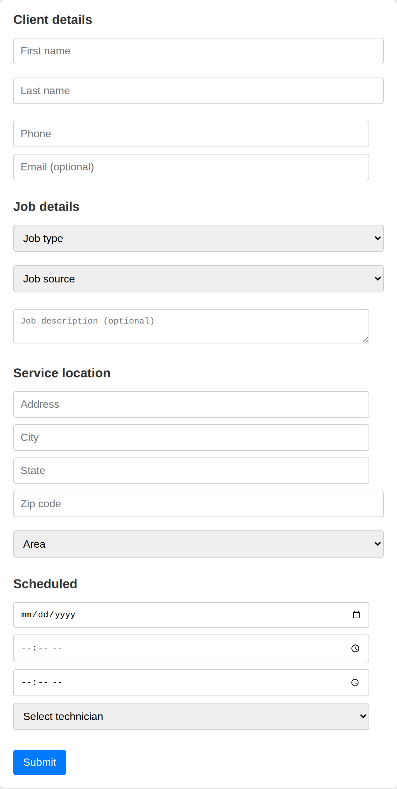

# Pipedrive Job Form

A browser extension for [Pipedrive](https://www.pipedrive.com/) that adds a job booking form to a deal. A dispatcher fills in client details, job info, service address and schedule, and the data is written straight into the deal's custom fields through the Pipedrive API.

<p align="center">
  
</p>

## How it works

```
Form (public/)  ──POST /submit──▶  Express server  ──PUT /v1/deals/:id──▶  Pipedrive API
```

1. The user fills in the form and clicks **Submit**.
2. The browser sends the form data as JSON to the Express server.
3. The server maps every form field to a Pipedrive custom field key and updates the deal.

The API token lives only on the server (in `.env`) and is never exposed to the browser.

## Form fields

| Section | Fields |
|---|---|
| Client details | First name, last name, phone, email |
| Job details | Job type, job source, description |
| Service location | Address, city, state, zip code, area |
| Scheduled | Date, start time, end time, technician |

First and last name are combined into a single "Client" field in Pipedrive.

## Tech stack

Node.js · Express · Axios · Helmet (Content Security Policy) · dotenv · vanilla HTML/CSS/JS

## Project structure

```
Pipedrive_App/
├── public/                 # Form UI, served as static files
│   ├── index.html
│   ├── script.js           # Collects form data and sends it to /submit
│   ├── styles.css
│   └── icon*.png           # Extension icons (16, 48, 128 px)
└── server/
    ├── server.js           # Express app, static files, CSP headers
    ├── routes/submit.js    # POST /submit endpoint
    └── utils/pipedrive.js  # Field mapping and Pipedrive API request
```

## Getting started

### 1. Install dependencies

```bash
git clone https://github.com/Palmson/Pipedrive_App.git
cd Pipedrive_App
npm install
```

### 2. Configure environment variables

Create a `.env` file in the project root:

```env
API_TOKEN=your_pipedrive_api_token
PORT=3000

# Pipedrive custom field keys
CLIENT_FIELD=
PHONE_FIELD=
EMAIL_FIELD=
JOBTYPE_FIELD=
JOBSOURCE_FIELD=
JOBDESCRIPTION_FIELD=
ADDRESS_FIELD=
CITY_FIELD=
STATE_FIELD=
ZIPCODE_FIELD=
AREA_FIELD=
STARTDATE_FIELD=
STARTTIME_FIELD=
ENDTIME_FIELD=
TECH_FIELD=
```

**API token.** In Pipedrive, open *Personal preferences → API* and copy your personal token.

**Field keys.** Every custom field in Pipedrive has a 40-character key. To list them, run:

```bash
curl "https://api.pipedrive.com/v1/dealFields?api_token=YOUR_TOKEN"
```

Find each field by its `name` and copy its `key` into the matching variable.

### 3. Run the server

```bash
node server/server.js
```

Then open http://localhost:3000.

